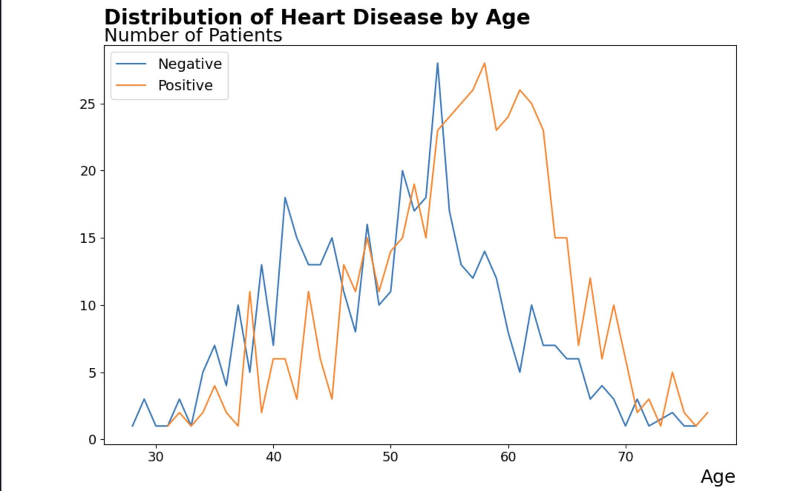
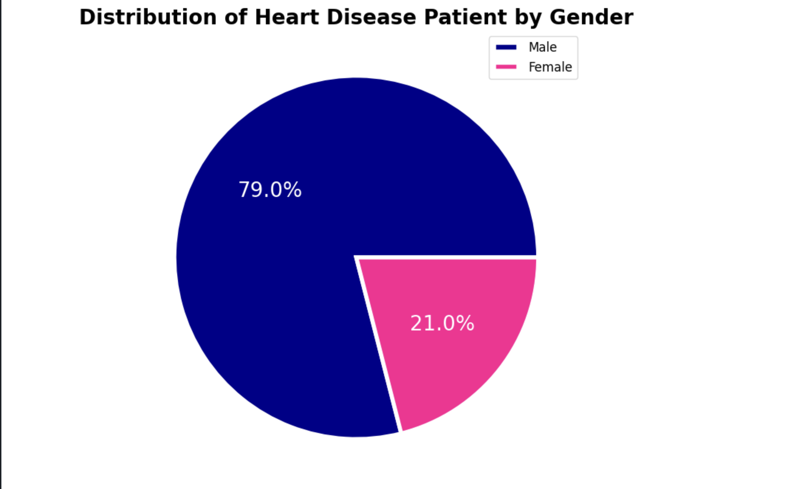
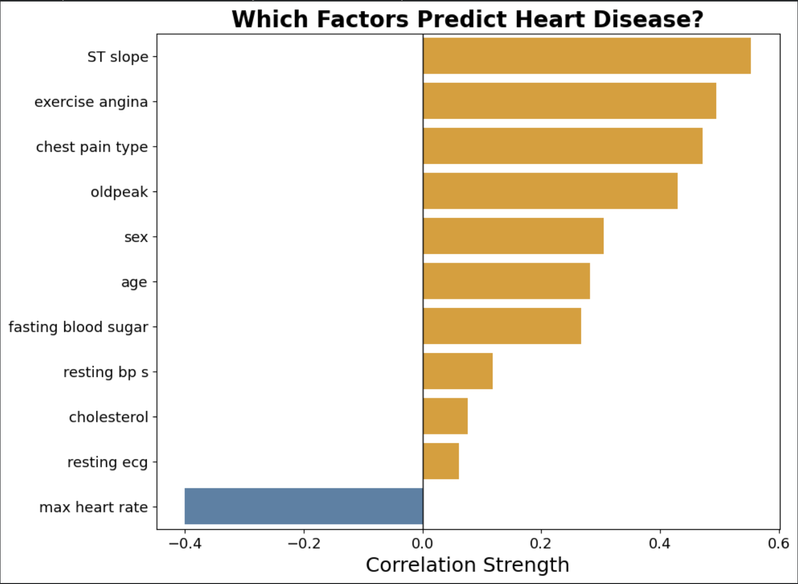
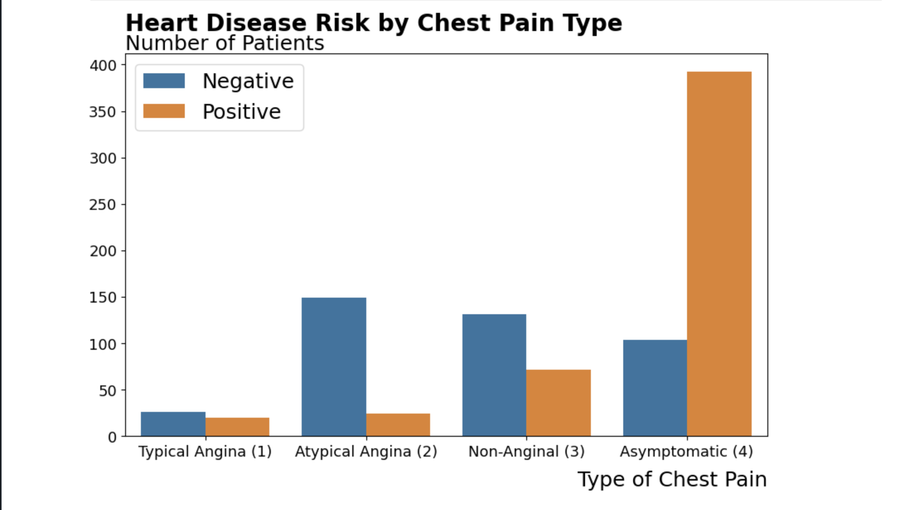
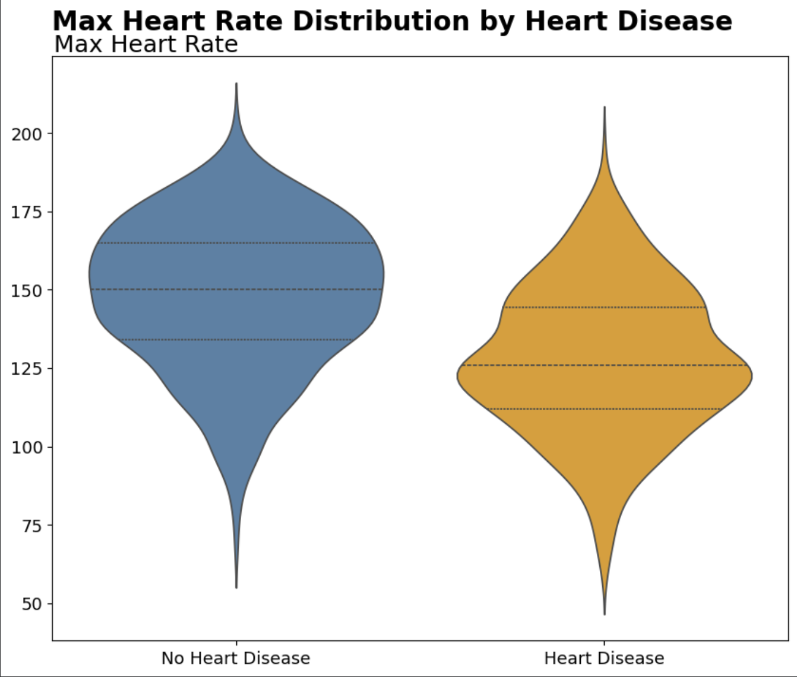

# Heart Disease Data Visualization

## Overview

This is a comprehensive Data Visualization project focused on analyzing and visualizing real-world heart disease patterns and risk factors. The project leverages statistical analysis and data visualization techniques to uncover meaningful insights from medical datasets, providing a visual framework for understanding heart disease epidemiology and clinical indicators.

## Project Objectives

- Analyze heart disease prevalence across demographic variables
- Identify key clinical and physiological factors that predict heart disease
- Visualize complex medical data in an intuitive and informative manner
- Provide data-driven insights for healthcare professionals and researchers
- Create reproducible and well-documented visualizations using Python

## Dataset Information

### Data Sources and Citations

The primary dataset used in this project was sourced from **Kaggle** and originally derived from the **UCI Machine Learning Repository**.

- **Kaggle Source:** [Heart Disease Dataset](https://www.kaggle.com/datasets/hosammhmdali/heart-disease-dataset) by Hosam Mohamed Ali
- **Original Source:** UCI Machine Learning Repository - Heart Disease Datasets

### Dataset Description

The Heart Disease dataset contains medical records of 303 patients with 14 clinical and demographic attributes:

- **Age:** Patient age in years
- **Sex:** Patient gender (Male/Female)
- **Chest Pain Type:** Classification of chest pain symptoms
- **Resting Blood Pressure:** Blood pressure at rest (mmHg)
- **Cholesterol:** Cholesterol levels (mg/dl)
- **Fasting Blood Sugar:** Blood sugar levels after fasting
- **Resting ECG:** Resting electrocardiographic measurements
- **Max Heart Rate:** Maximum heart rate achieved during exercise
- **Exercise Angina:** Angina induced by exercise
- **ST Depression:** ST segment depression induced by exercise
- **ST Slope:** Slope of the ST segment
- **Target Variable:** Heart disease presence (0 = Negative, 1 = Positive)

## Data Processing

The project includes comprehensive data cleaning and preprocessing steps:

1. **Data Cleaning Notebook** (`Data_Cleaning.ipynb`): Handles missing values, data type conversions, and outlier detection
2. **Raw Dataset:** `Raw_Data_HeartDisease.csv` - Original unprocessed data
3. **Cleaned Dataset:** `Cleaned_Data_HeartDisease.csv` - Processed and validated data ready for analysis

## Visualizations

### Graph 1: Distribution of Heart Disease by Age



**Type:** Multi-series Line Chart

**Description:** This visualization presents the distribution of heart disease cases across different age groups, with separate trend lines for patients with negative (blue line) and positive (orange line) diagnoses.

**Key Insights:**
- Heart disease prevalence increases significantly after age 40
- Peak incidence occurs around ages 55-60, with approximately 28 positive cases at the maximum
- Both negative and positive cases show high variability across age groups
- The prevalence of heart disease cases declines sharply after age 65
- The pattern suggests age as a significant risk factor for heart disease development

---

### Graph 2: Distribution of Heart Disease Patients by Gender



**Type:** Pie Chart

**Description:** This visualization illustrates the gender distribution within the heart disease patient population, displaying the percentage breakdown between male and female patients.

**Key Insights:**
- Male patients represent 79.0% of the study population
- Female patients represent 21.0% of the study population
- The dataset shows a significant male predominance in heart disease diagnosis
- This 4:1 male-to-female ratio is consistent with epidemiological patterns indicating higher heart disease prevalence in men
- The imbalance suggests biological, lifestyle, or diagnostic differences between genders

---

### Graph 3: Which Factors Predict Heart Disease?



**Type:** Horizontal Bar Chart (Feature Importance/Correlation Analysis)

**Description:** This visualization displays the correlation strength between various clinical and demographic factors and heart disease presence, ranked by predictive importance.

**Key Insights:**
- **ST Slope** demonstrates the strongest positive correlation (≈0.55) with heart disease, making it the most predictive factor
- **Exercise-Induced Angina** shows the second-strongest positive correlation (≈0.48)
- **Chest Pain Type** is highly correlated (≈0.47) with disease presence
- **Old Peak (ST Depression)** and **Maximum Heart Rate** show moderate correlations
- **Sex** and **Age** demonstrate weaker but still significant correlations
- **Fasting Blood Sugar**, **Resting Blood Pressure**, and **Cholesterol** have weak correlations
- **Resting ECG** and **Max Heart Rate** show the weakest correlations
- The inverse correlation of maximum heart rate (negative bar) indicates lower heart rates in disease patients

---

### Graph 4: Heart Disease Risk by Chest Pain Type



**Type:** Grouped Bar Chart

**Description:** This visualization compares the number of patients with negative and positive heart disease diagnoses across four different types of chest pain classifications.

**Key Insights:**
- **Asymptomatic Chest Pain (Type 4)** shows the highest disease prevalence, with approximately 390 positive cases compared to 105 negative cases
- **Atypical Angina (Type 2)** demonstrates a more balanced distribution, with approximately 145 negative cases and only 25 positive cases
- **Non-Anginal Chest Pain (Type 3)** shows moderate disease presence with 130 negative and 75 positive cases
- **Typical Angina (Type 1)** has the lowest patient count overall, with minimal disease cases
- Asymptomatic presentations paradoxically show the highest disease risk, suggesting silent ischemia or underdiagnosis in other groups
- Chest pain type is a critical differentiating factor in disease risk assessment

---

### Graph 5: Max Heart Rate Distribution by Heart Disease



**Type:** Violin Plot with Quartile Distribution

**Description:** This visualization presents the distribution of maximum heart rate achieved during exercise stress tests, compared between patients without heart disease (blue) and with heart disease (orange).

**Key Insights:**
- Patients **without heart disease** show a mean maximum heart rate of approximately 150-165 bpm
- Patients **with heart disease** demonstrate a notably lower mean maximum heart rate of approximately 125-140 bpm
- The blue violin (no disease) shows a broader distribution, indicating greater physiological capacity
- The orange violin (disease) is more concentrated at lower values, suggesting exercise intolerance
- Quartile markers show that heart disease patients rarely achieve heart rates above 175 bpm
- Maximum heart rate is inversely correlated with heart disease, serving as a protective indicator
- This difference reflects reduced exercise capacity and cardiac output limitations in diseased hearts

---

## Project Structure

```
Data-Visualization/
├── README.md                              # Project documentation
├── LICENSE                                # MIT License
│
├── Data Files/
│   ├── Raw_Data_HeartDisease.csv         # Original unprocessed dataset
│   └── Cleaned_Data_HeartDisease.csv     # Processed and cleaned dataset
│
├── Jupyter Notebooks/
│   ├── Data_Cleaning.ipynb               # Data preprocessing and validation
│   ├── Initial_visualisation.ipynb       # Basic exploratory visualizations
│   ├── visual.ipynb                      # Primary visualization analysis
│   ├── visual(1).ipynb                   # Extended visualization studies
│   ├── visual(2).ipynb                   # Additional analytical visualizations
│   └── Additional_visualisation.ipynb    # Supplementary visualization insights
│
├── Presentations/
│   └── HeartDisease.pptx                 # Summary presentation
│
└── Visualizations/
    ├── GRAPH-1.png                       # Distribution by Age
    ├── GRAPH-2.png                       # Distribution by Gender
    ├── GRAPH-3.png                       # Predictive Factors Analysis
    ├── GRAPH-4.png                       # Risk by Chest Pain Type
    └── GRAPH-5.png                       # Heart Rate Distribution
```

## Technologies and Tools

- **Python 3.x:** Core programming language
- **Pandas:** Data manipulation and analysis
- **NumPy:** Numerical computing and arrays
- **Matplotlib:** Plotting and visualization library
- **Seaborn:** Statistical data visualization
- **Scikit-learn:** Machine learning and statistical analysis
- **Jupyter Notebook:** Interactive development environment

## Key Findings

### Demographic Patterns
- Heart disease shows a strong age-dependent prevalence with peak incidence in middle-aged populations
- Male patients significantly outnumber female patients in the dataset (79% vs. 21%)
- Age and gender are notable but not the strongest predictors of heart disease

### Clinical Indicators
- **ST Slope** (derived from ECG stress tests) is the most reliable predictor of heart disease
- **Exercise-induced angina** and **chest pain classification** are critical diagnostic indicators
- **Maximum heart rate** inversely correlates with disease presence, indicating reduced cardiac capacity

### Chest Pain Classification
- Asymptomatic presentations paradoxically carry the highest disease burden
- Traditional anginal chest pain shows lower disease prevalence
- Chest pain type is essential for risk stratification and diagnostic assessment

### Physiological Parameters
- Patients with heart disease achieve significantly lower maximum heart rates during exercise
- Exercise intolerance is a consistent feature of heart disease presentation
- Maximum heart rate serves as an objective measure of cardiac functional capacity

## Usage Instructions

### Running the Analysis

1. **Clone the Repository**
   ```bash
   git clone https://github.com/Ramesh-Bartaula/Data-Visualization.git
   cd Data-Visualization
   ```

2. **Install Required Dependencies**
   ```bash
   pip install pandas numpy matplotlib seaborn scikit-learn jupyter
   ```

3. **Launch Jupyter Notebook**
   ```bash
   jupyter notebook
   ```

4. **Execute Notebooks in Order**
   - Start with `Data_Cleaning.ipynb` for data preprocessing
   - Follow with `Initial_visualisation.ipynb` for exploratory analysis
   - Examine `visual.ipynb`, `visual(1).ipynb`, and `visual(2).ipynb` for comprehensive analysis
   - Review `Additional_visualisation.ipynb` for supplementary insights

### Creating Custom Visualizations

The notebooks include reproducible code for generating all visualizations. Users can:
- Modify data subsets to analyze specific populations
- Adjust visualization parameters (colors, sizes, styles)
- Create new analyses based on the provided framework
- Export results to various formats (PNG, PDF, SVG)

## Conclusions

This data visualization project successfully demonstrates the multifactorial nature of heart disease. While demographic factors such as age and gender play important roles, clinical indicators—particularly ST slope changes, exercise-induced angina, and maximum achievable heart rate—prove to be superior predictors of disease presence. The visualizations collectively support the need for comprehensive cardiac assessment protocols incorporating both demographic risk stratification and detailed functional testing.

The project provides a foundation for further research into:
- Predictive modeling using machine learning algorithms
- Risk stratification algorithms for clinical practice
- Population-specific prevention strategies
- Gender-based differences in disease presentation and outcomes

## Author

**Ramesh Bartaula**

## License

This project is licensed under the MIT License - see the [LICENSE](LICENSE) file for details.

The MIT License permits free use, modification, and distribution of this work for both commercial and non-commercial purposes, provided proper attribution is maintained.

## Acknowledgments

- **Kaggle:** For hosting and providing access to the dataset
- **UCI Machine Learning Repository:** For the original data source
- **Data Science Community:** For methodologies and visualization best practices

## Disclaimer

This project is for educational and research purposes. The visualizations and analyses are based on the provided dataset and should not be used as a substitute for professional medical advice. All medical decisions should be made in consultation with qualified healthcare professionals.

## Contact and Support

For questions, suggestions, or collaboration inquiries regarding this project, please visit the GitHub repository or contact the project author through appropriate channels.

---

**Last Updated:** April 2026
**Project Status:** Active
